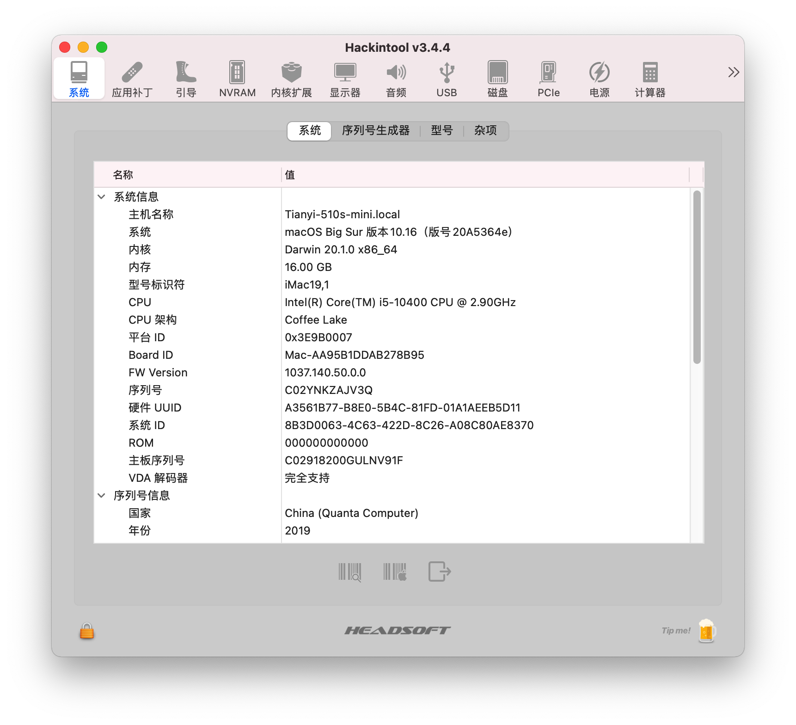

# Lenovo 天逸 510S Mini Hackintosh

## 电脑配置

|   规格   |                           详细信息                           |
| :------: | :----------------------------------------------------------: |
| 电脑型号 |                  联想Lenovo 天逸 510S Mini                   |
| 操作系统 |                        macOS Big Sur                         |
|  处理器  |                    英特尔 酷睿 i5 - 10400                    |
|   内存   |                             16GB                             |
|  硬盘1   |               SKhynix 256GB，已更换为WD SN750                |
|  硬盘2   |                       ST2000LM007 2TB                        |
|   显卡   |                  Intel HD Graphics CFL CRB                   |
|  显示器  |                              无                              |
|   声卡   |                        Realtek ALC235                        |
|   网卡   | Intel AX201，已更换为 [DW1820A](https://blog.daliansky.net/DW1820A_BCM94350ZAE-driver-inserts-the-correct-posture.html) |

## 截屏

## EFI下载

该机型刚适配完，还在完善中，不日即可提供下载。敬请期待！